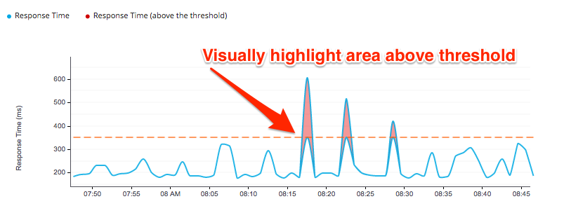

= http://github.com/hawkular/hawkular-charts[Hawkular Charting Directives]

This project provides AngularJS directives for displaying visual representations of time series data as charts. It uses http://d3js.org[D3] as its charting toolkit and tries to simply creating metrics visualizations by using Angular.js.

== About

The parent project that spurred this project is http://github.com/hawkular/hawkular[Hawkular] - A Metrics engine based
on http://cassandra.apache.org/[Cassandra]. The console in Hawkular uses these charting components and will further push the development
of these charting components into the future with additional features and specialized chart types.
This will also make adhoc development quicker/easier with components that can render Hawkular Metrics graphs with very little effort.

== Charts

==== Metrics Chart Type

_Sample code for this chart:_

[source,javascript]
----
<hawkular-chart
    data="{{dataPoints}}"
    chart-type="hawkularmetric"
    alert-value="{{threshold}}"
    y-axis-units="Response Time (ms)"
    chart-height="250">
</hawkular-chart>
----
Want to update the chart, no problem, just alter the dataPoints array with new data and the chart will re-render itself.
Need to change the threshold or chart-type just use Angular's two way binding to bind to a field on the screen and watch the dynamics unfold.

Explore the actual implementation in Hawkular Console: https://github.com/hawkular/hawkular/blob/master/ui/console/src/main/scripts/plugins/metrics/plugins/metrics/html/response-time.html[here]

==== Availability Chart Type
image::img/avail-chart.png[Hawkular Availability Chart Type]

_Sample code for this chart:_

[source,javascript]
----
<availability-chart
    data="{{vm.availabilityDataPoints}}"
    chart-type="availability">
</availability-chart>

----
Use the Availability charts for your own projects, the format is universal.
Availability charts are quite simple just pass an array of [time:number, value:string] (where the value is ('up', 'down' or 'unknown') points to render.

Explore the actual implementation in Hawkular Console: https://github.com/hawkular/hawkular/blob/master/ui/console/src/main/scripts/plugins/metrics/plugins/metrics/html/availability.html[here]

==== Other Chart Types
image::img/chart-sample.jpg[Charts]

Don't like the charts we have? Take one of the existing charts and modify (coming soon!)

== How to Get

        bower install hawkular-charts --save

Or

*Download:* http://github.com/hawkular/hawkular-charts/blob/master/hawkular-charts.js[hawkular-charts.js]

== Using the Charting Directives
Bind to a javascript array of metrics:

[source,javascript]
----
 <hawkular-chart
     data="{{vm.getChartDataFor(selectedMetric)}}"
     chart-type="{{selectedChart.chartType}}"
     chart-height="250">
 </hawkular-chart>
----

The nice part of about using angular in the charting framework is that whenever the underlying data changes, watchers automatically load and re-render the chart (as well as any of the properties that may have changed like chart-type).
This results in less code and more productivity.

.Prerequisite setup:
. Add the hawkular-charts.css to the main index.html page
. Add the charting module to the application module: `app.module('myApp', ['hawkular.charts']);`

All that's left to do now is select the chart type and bind the _data_ attribute on the __<hawkular-chart>__ directive.

=== Stand Alone Live Updating Tag Example
__Want to add some dynamically updating charts to your own pages?__

The stand alone version of the tag allows for linking to hawkular-metrics servers (or any supplier of formatted metric data) without any dependencies except for a few js libs and 2 lines of script to setup an Angular app.

[source,javascript]
----
<hawkular-chart
        chart-type="bar"
        metric-id="server2.cpu.user"
        metric-url="http://127.0.0.1:8080/hawkular/metrics"
        time-range-in-seconds="86400002"
        refresh-interval-in-seconds="30"
        chart-height="250" >
</hawkular-chart>
----

This allows plain html web pages to be sprinkled with tags and a couple js libs and you can have dynamic live updating metrics. Great for NOCs or dashboards. These pages can even be emailed around and then thrown behind an http server for viewing.

*Sample Stand Alone Example Page:*  https://github.com/hawkular/hawkular-charts/blob/master/stand-alone-chart-sample.html[stand-alone-chart-sample.html]
This allows dashboard templates to be emailed around (although they need to be rendered behind a http server of your choice).

== Chart Customization

.This project is built around customization. There are several forms of customization:
- Most cosmetic issues are controlled via standard css through the http://github.com/hawkular/hawkular-charts/blob/master/css/hawkular-charts.css[hawkular-charts.css].
- Overlay previous time period
- Tag a point or range on the Chart and annotate with description and/or symbol for later retrieval/comparison. This includes the ability to persist to either client brwowser store or Hawkular Metrics Cassandra: _Soon!_
- Custom Indicators: _Soon!_

== Building the Project

.You have to install required software before you're able to use grunt to build:
* Install _Node.js_ - Find more information on http://nodejs.org/[Node.js]
** Install _npm_ - If npm is not already installed with Node.js, you have to install it manually. Find more information on https://www.npmjs.org/[npm]
* Install _Gulp_ and _Bower_ globally:   `npm install -g bower gulp`
* Install _npm_ dependencies with:  `npm install`
* Install _bower_ dependencies with:  `bower install`

The environment is now ready to be built.

The *Hawkular Charts*  directives can be built with: `gulp`. Only the one command is needed as building is so fast that a watcher task is not necessary.

The resulting javascript file is placed in the root directory as _hawkular-charts.js_

== Consuming Hawkular Charts from Hawkular Project
Easily setup bower linking so that changes to the charts are instantly reflected in Hawkular console...

https://github.com/hawkular/hawkular/tree/master/ui#other-packages-development[Integrating with Hawkular]

== Contributing

We're always interested in contributions from the community.

.Please ensure that your Pull Request provides the following:
* Detailed description of the proposed changes
* Rebased onto the latest master commit
* This is a http://github.com/Microsoft/TypeScript/[Typescript] project, so please submit the typescript source (not the javascript source; javascript submissions will be rejected)
