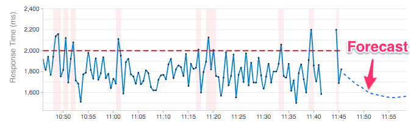
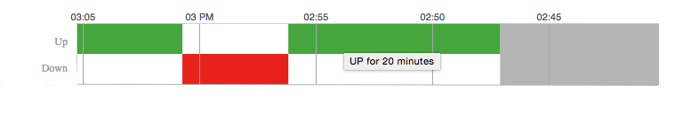
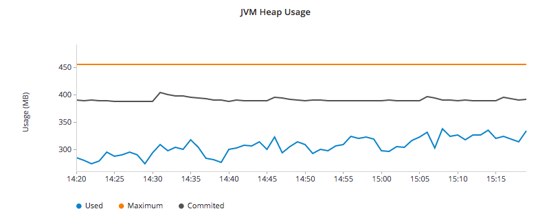

= http://github.com/hawkular/hawkular-charts[Angular Directives for Metrics Visualization]

__"Legos for Metrics Visualization"__

image::https://www.bithound.io/github/hawkular/hawkular-charts/badges/score.svg[link="https://www.bithound.io/github/hawkular/hawkular-charts"]
image::https://www.bithound.io/github/hawkular/hawkular-charts/badges/dependencies.svg[link="https://www.bithound.io/github/hawkular/hawkular-charts/master/dependencies/npm"]

This project provides AngularJS directives for displaying custom visual representations of time series data as charts.
It uses http://d3js.org[D3] as its charting toolkit and tries to simplify creating advanced metrics visualizations
with Angular.js directives.

While designed for use in the Hawkular UI console, it is a general purpose, metrics charting library designed to work with any array of data as long as it can be transformed into a tuple of datetime/value pairs.

== About

Hawkular Charts is a direct result of wanting metric visualizations for the parent project:
http://github.com/hawkular/hawkular[Hawkular] - _An Open Source
Monitoring Tool_. The console in Hawkular uses these charting components and will further push the development
of these charting components into the future with additional features and specialized chart types.
This will also make adhoc development quicker/easier with components that can render Hawkular Metrics (or any other metrics) charts with very little effort.

== Development Quickstart

The quickest way to start using the charts is to fire up a http server and start playing with the code. Make sure
that https://nodejs.org[Node.js version 6.x] is installed. Then, to run the examples, from the
_hawkular-charts_ root directory:

`npm install && bower install`

`gulp` for a dev build that live loads or `gulp build` to build a production build.

This command will startup a web server and launch the default browser to that page -- listening for any
changes in your code and automatically refreshing the browser with changes. Additionally, it will sync the
changes to all of the browsers with localhost:3001/* open -- making it easy to check across multiple browsers and
even mobile browsers for responsive layout changes!

IMPORTANT: Gulp version 3.9.0+ is required (since we use an ES6 gulpfile)

These controls are currently being used in the Hawkular Console to view various metrics charts displayed there.
Please see https://github.com/hawkular/hawkular/tree/master/console for more real examples.

== Charts

=== Chart Types

Chart types are set via the *chart-type* attribute of the *hk-metric-chart* directive.
The following chart types are available:

* *line:* this is the default chart type if not specified and is recommended for most metrics display
* _hawkularmetric:_ specifically tailored toward Single Metrics Display (default if you don't specify) __DEPRECATION WARNING: this will be replaced with *line* in the future__
* *histogram:* histogram bar chart (used in Hawkular GC chart)
* *area:* standard area chart with hawkular extensions
* *scatter:* regular scatter plot supporting avg/high/low
* *multiline:* specifically made for display multiple metrics in a singe graph
* *rhqbar:* http://rhq-project.github.io/rhq/[RHQ/JON] style graphs https://docs.jboss.org/author/display/RHQ/d3+Charts

All of the chart types are either in the process of being approved by Red Hat UxD, or have been approved.

==== Metrics Chart
image::img/hawkular-metric-charts.png[Hawkular Metrics Chart Type]

_Sample code for this chart:_

[source,javascript]
----
<hk-metric-chart
    data="dataPoints"
    chart-type="line"
    alert-value="{{threshold}}"
    y-axis-units="Response Time (ms)">
</hk-metric-chart>
----
Need to update the chart? No problem, just alter the dataPoints array with new data and the chart will re-render itself.
Through custom attributes it is very easy to configure a custom chart just the way you want using advanced
capabilities that standard charting libraries don't provide.
Need to change the threshold alert value or chart-type just use Angular's two way binding to bind to a field on the
screen and watch the dynamics unfold.

===== Forecasting Feature

The metrics chart has the ability to display forecasting (of data into the future) with the addition of the
*forecastData* attribute. These future datapoints show in the chart as a dashed line. This data attribute uses the same
data format as *data* but only require *timestamp* and *value* fields.
Additionally, an optional *min* and *max* field can be added to display a confidence interval around the forecast
values. The *forecastData* can provide as many or as little data points as desired (but the spacing
between timestamps should be the same as with the *data* points to keep visual consistency.

_Example:_
[source,javascript]
----
  var myForecastData = [
    {'timestamp': 1434480361167, 'value': 1780, 'min': 1740, 'max': 1790},
    {'timestamp': 1434480511167, 'value': 1680, 'min': 1640, 'max': 1760}
  ];
----

==== Availability Chart Type

_Sample code for this chart:_

[source,javascript]
----
<hk-availability-chart data="vm.availabilityDataPoints"></hk-availability-chart>
----
The availability chart makes it easy to visualize the availability types:

* up
* down
* unknown (no data was collected for this time period, so we don't know if it was up or down)

on a time line. (The data formats are discussed later).
Hovering over one of the areas provides additional information such as: when the period started/ended, the duration
of the period and the status of the period.

==== Multi-line Chart Type
Here is an screen shot from the Hawkular Console that uses the multi-line chart for displaying JVM metrics:

__This chart type would also be used for displaying multiple metrics in a single chart.__
Don't like the charts we have? Take one of the existing charts and modify (there are many types in the code).

== How to Get

        bower install hawkular-charts --save

Or

*Download:* http://rawgit.com/hawkular/hawkular-charts/master/hawkular-charts.js[hawkular-charts.js]

== Using the Charting Directives
Bind to a javascript array of metrics:

[source,javascript]
----
 <hk-metric-chart
     data="vm.getChartDataFor(selectedMetric)"
     chart-type="{{selectedChart.chartType}}">
 </hk-metric-chart>
----

The nice part of about using angular in the charting framework is that whenever the underlying data changes, watchers automatically load and re-render the chart (as well as any of the properties that may have changed like chart-type).
This results in less code and more productivity.

.Prerequisite setup:
. Add the hawkular-charts.css to the main index.html page
. Add the hawkular-charts.js to the main index.html page
. Add the charting module to the application module: `app.module('myApp', ['hawkular.charts']);`

All that's left to do now is select the chart type and bind the _data_ attribute on the __<hk-metric-chart>__ directive.

=== Stand Alone Live Updating Tag Example
__Quickly and easily add some dynamically updating charts to your own pages__

The stand alone version of the tag allows for linking to hawkular-metrics servers (or any supplier of formatted metric data) without any dependencies except for a few js libs and 2 lines of script to setup an Angular app.

[source,javascript]
----
<hk-metric-chart
        chart-type="bar"
        metric-id="server2.cpu.user"
        metric-type="gauge"
        metric-tenant-id="myTenant"
        metric-url="http://127.0.0.1:8080/hawkular/metrics"
        time-range-in-seconds="86400002"
        refresh-interval-in-seconds="30" >
</hk-metric-chart>
----

This allows plain html web pages to be sprinkled with tags and a couple js libs and you can have dynamic live updating metrics. Great for NOCs or dashboards. These pages can even be emailed around and then thrown behind an http server for viewing.

*Sample Stand Alone Example Page:*  https://github.com/hawkular/hawkular-charts/blob/master/stand-alone-chart-sample.html[stand-alone-chart-sample.html]
This allows dashboard templates to be emailed around (although they need to be rendered behind a http server of your choice).

== Data Formats

Metric Time Series data is generally viewed as a Tuple: `{metric, time, value}`. The Hawkular charts version looks like
this:

=== Availability Data

.Table Availability Data Format
|===
|Name |Type |Required |Description

|start
|number
|Yes
|Integer representing Starting period timestamp - milli-seconds since epoch(unix)

|end
|number
|Yes
|Integer representing Ending period timestamp - milli-seconds since epoch(unix)

|value
|text
|Yes
|String enum of Availability Type('up','down','unknown')

|duration
|text
|No
|String with duration period to show in hover

|message
|text
|No
|String with message **Not Used Yet**
|===

_Example:_
[source,javascript]
----
 var availChartData = [{"timestamp": 1438025381038, "value": "up"},
     {"timestamp": 1438031047504, "value": "down"}];
----

=== Metrics Data

==== Single Chart Data Format

.Table Aggregated Metrics Data Format
|===
|Name |Type |Required |Description

|timestamp
|number
|Yes
|Integer representing milli-seconds since epoch(unix)

|avg
|number
|Yes
|Any valid number (int or decimal)

|min
|number
|No
|Any valid number (int or decimal)

|max
|number
|No
|Any valid number (int or decimal)

|empty
|boolean
|No
|boolean indicating if the chart should show *missing* data representation for this time period. This overrides the
actual values.
|===

_Aggregate Metrics Example:_
[source,javascript]
----
  var metricData = [{
        "timestamp": 1434476761167,
        "avg": 1912,
        "min": 1482,
        "max": 2342,
        "empty": false
      }, {
        "timestamp": 1434476791167,
        "avg": 1816,
        "min": 1816,
        "max": 1816,
        "empty": false
      }];
----

TIP: If you don't have aggregate values (maybe you aren't using Hawkular Metrics) then just populate the *avg* value with the desired metric value. Min, Max and Empty are optional.

NOTE: Everything ends up being an aggregated value in time (usually after 8 hours). This is due to needing a
consistently representable dataset that charts nicely. Raw datasets can easily become bottlenecks to the clients
charting the data and unintended consequences of very large or small datasets can make for _strange_ looking charts.
For this reason, we recommend bucketing data into a fixed set of datapoints that the charting client is comfortable
handling performance-wise and that generally _fits_ the chart

==== Multi-Chart Data Format

.Table Multi-Chart Data Format
The multi-chart data format used to show multiple charts(metrics) on a single chart is the same _values_ data as the above metrics data format, but just adds a nested (__d3 nested__) array of map values. This consists of key --> values pairs with the _key_ being the name of the dataset and the _values_ being the array of values metric data described in the preceding section. This is probably most easily illustrated by a code example:

_Example:_
[source,javascript]
----
 var nestedData = [
  {"key" : "red hat", "values" : redhatData },
  {"key" : "amazon", "values" : amazonData }
 ];
----

== Chart Customization

.This project is built around customization. There are several forms of customization:
- Most cosmetic issues are controlled via standard css(LESS) through the https://github
.com/hawkular/hawkular-charts/blob/2fde03777b428a424c12ecc1c80aeb558ebad78c/src/less/hawkular-charts
.less[hawkular-charts.less].
- Additional(new) functionality is offered through custom attributes.
- New chart types are easily created by simply creating a new https://github
.com/hawkular/hawkular-charts/blob/ed24b148057b9b2aa52c63079f97c0858775f8ba/src/chart/types.ts#L39-L39[ChartType]
class with a name and drawChart method. And then adding it to the https://github
.com/hawkular/hawkular-charts/blob/2fde03777b428a424c12ecc1c80aeb558ebad78c/src/chart/metric-chart-directive
.ts[registered chart types]

== Building the Project

.You have to install required software before you're able to use grunt to build:
* Install _Node.js_ - Find more information on http://nodejs.org/[Node.js]
** Install _npm_ - If npm is not already installed with Node.js, you have to install it manually. Find more information on https://www.npmjs.org/[npm]
* Install _Gulp_ and _Bower_ globally:   `npm install -g bower gulp`
* Install _npm_ dependencies with:  `npm install`
* Install _bower_ dependencies with:  `bower install`

The environment is now ready to be built.

The *Hawkular Charts*  directives can be built with: `gulp build`. Or, for dev build that updates with every
change: `gulp`

The resulting javascript file is placed in the root directory as _hawkular-charts.js_

== Consuming Hawkular Charts from Hawkular Project

Easily setup bower linking so that changes to the charts are instantly reflected in Hawkular console...

http://www.hawkular.org/docs/dev/ui-dev.html[Integrating with Hawkular]

== Hawkular UI Services

__What good is a chart if you don't have a way to get the metric data?__

If you don't want to retrieve data directly from the REST Url, we have an API that is a wrapper around ngResources. For angular apps this is probably the easiest and most powerful way to access Hawkular data. There are currently API wrappers around:

. http://www.hawkular.org/docs/rest/rest-metrics.html[Hawkular Metrics]
. http://www.hawkular.org/docs/rest/rest-inventory.html[Hawkular Inventory]
. http://www.hawkular.org/docs/rest/rest-alerts.html[Hawkular Alerts]
. https://github.com/hawkular/hawkular-agent[Hawkular Agent] (via websockets)

[source,javascript]
----
//
// Querying Availability
//
 HawkularMetric.AvailabilityMetricData(this.$rootScope.currentPersona.id).query({
          availabilityId: metricId,
          start: startTime,
          end: endTime,
          distinct: true
        }).$promise
          .then((response) => {
            this.availabilityDataPoints = response;
          }, (error) => {
            this.NotificationsService.error('Error Loading Avail Data: ' + error);
          });
//
// Here is a real-world example querying multiple metrics for a multi-line graph
// the data is put into the chartWebSessionData array for charting
// Querying both Gauge and Counter metrics
//
 HawkularMetric.GaugeMetricData(this.$rootScope.currentPersona.id).queryMetrics({
        gaugeId: 'MI~R~[' + this.$routeParams.resourceId +
        '~/]~MT~WildFly Aggregated Web Metrics~Aggregated Active Web Sessions',
        start: this.startTimeStamp,
        end: this.endTimeStamp, buckets:60}, (data) => {
        this.chartWebSessionData[0] = { key: 'Active Sessions',
          color: AppServerWebDetailsController.ACTIVE_COLOR, values: this.formatBucketedChartOutput(data) };
      }, this);

 HawkularMetric.CounterMetricData(this.$rootScope.currentPersona.id).queryMetrics({
        counterId: 'MI~R~[' + this.$routeParams.resourceId +
          '~/]~MT~WildFly Aggregated Web Metrics~Aggregated Expired Web Sessions',
        start: this.startTimeStamp,
        end: this.endTimeStamp, buckets:60}, (data) => {
        this.chartWebSessionData[1] = { key: 'Expired Sessions',
          color: AppServerWebDetailsController.EXPIRED_COLOR, values: this.formatCounterChartOutput(data) };
      }, this);
----

https://github.com/hawkular/hawkular-ui-services

== FAQ

.Questions about Hawkular-charts
* There used to be a width and height attribute in the charting directives, what happened to those?
_Answer_: Hawkular-charts is now fully responsive so height and width no longer make sense. Height and width is now
determined by the container surrounding the chart directive (a div for example).

== Version 1.0

.Verion 1.0 introduces some breaking changes to be aware of from previous releases:
* Breaking Change: Rename ‘hawkular-chart’ directive to ‘hk-metric-chart’ to be more meaningful, now that there are
multiple charting tags
* Breaking Change: Renamed all chart types with a ‘hk-*’ prefix to be more consistent with standard directive library
naming conventions

Other updates for 1.0 can be found at: https://github.com/hawkular/hawkular-charts/releases/tag/v1.0.0[v1.0.0]

== Contributing

We're always interested in contributions from the community.

.Please ensure that your Pull Request provides the following:
* Detailed description of the proposed changes
* Use the https://github.com/hawkular/hawkular/blob/master/angular-style-guide.adoc[Angular Typescript Style Guide]
for reference.
* Rebased onto the latest master commit
* This is a http://github.com/Microsoft/TypeScript/[Typescript] project, so please submit the _Typescript source_ (*not*
 the javascript source; javascript submissions will be rejected)
* Issues/Bugs can be reported via https://issues.jboss.org/browse/HAWKULAR/[Hawkular Jira]

__We would like to give special Thanks to the Red Hat, User Experience Team (UxD) for their design expertise.__
